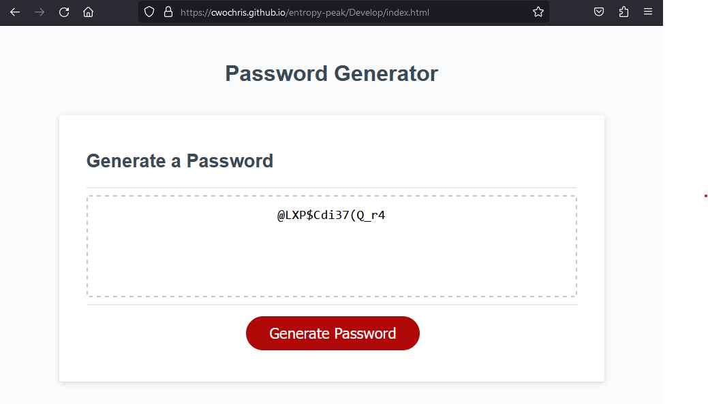

# Password Generator Starter Code

Live deployed URL: https://CWOChris.github.io/entropy-peak/Develop/index.html

This page will generate a password at random from a given string of characters.  It is a work in progress and in its current form, will spit out a relatively predictable password.  In that sense, the passwords it produces should not actually be used for any purpose other than demonstrating how the for-loop is used in the function to generate the random password.

That aside, when you click the link, you will be prompted to choose between 8 and 128 character length for your password.  It will eventually also prompt you to choose between a weak, middle and strong level password which contain alpha, alpha-numeric and alpha-numeric + special characters.

In the future I plan to add a more intuitive prompt for the user that activates only after the red button is clicked, rather than being immediately prompted when the user visits the URL.  I also plan to use some kind of cryptology API and/or cypher to make the passwords generated as least predictable as I possibly can.

Screenshot of the deployed application:

AS AN employee with access to sensitive data
I WANT to randomly generate a password that meets certain criteria
SO THAT I can create a strong password that provides greater security

GIVEN I need a new, secure password
WHEN I click the button to generate a password
THEN I am presented with a series of prompts for password criteria
WHEN prompted for password criteria
THEN I select which criteria to include in the password
WHEN prompted for the length of the password
THEN I choose a length of at least 8 characters and no more than 128 characters
WHEN asked for character types to include in the password
THEN I confirm whether or not to include lowercase, uppercase, numeric, and/or special characters
WHEN I answer each prompt
THEN my input should be validated and at least one character type should be selected
WHEN all prompts are answered
THEN a password is generated that matches the selected criteria
WHEN the password is generated
THEN the password is either displayed in an alert or written to the page